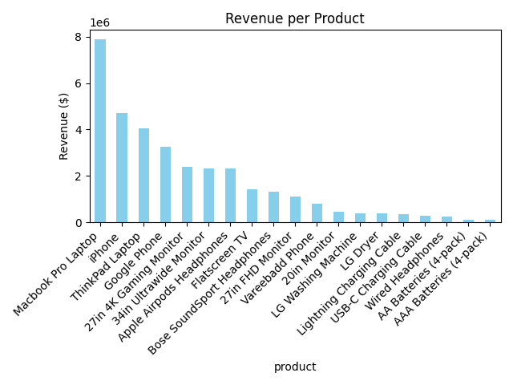

# 📊 Basic Sales Summary Using SQLite and Python

This project demonstrates how to generate a simple sales summary using SQL in Python, with results printed and visualized via matplotlib.

## ✅ Objective
- 🔗 Connect to a small SQLite database
- 📝 Run SQL queries to summarize sales data
- 📊 Display results using `print()` and a basic bar chart

## 📂 Files
- `Sales_Data.ipynb` – Jupyter Notebook/Google Colab with all the code
- `Dataset.csv` – Sample sales dataset
- `Dataset.db` – SQLite database created within the notebook
- `sales_chart.png` – Generated bar chart showing revenue by product
- `summary_all_data.csv` – Exported summary of sales data in CSV format

## 📦 **Tools Used**
- 🐍 [Python (3.x)](https://www.python.org/downloads/)
- 🗄️ [SQLite (via sqlite3)](https://sqlite.org/download.html)
- 🔢 [Pandas](https://pandas.pydata.org/)
- 📊 [Matplotlib](https://matplotlib.org/stable/users/installing.html)
- 💻 [Jupyter Notebook (via JupyterLab or Anaconda)](https://jupyter.org/install)

## 🛠 Features
- Create and populate SQLite database from CSV
- Run SQL query to calculate total quantity sold and revenue per product
- Load SQL result into a Pandas DataFrame
- Display tabular results
- Generate and save a bar chart for visual insights

## 📈 Output Example
Bar chart showing total revenue per product, generated using matplotlib.

## ▶️ How to Run
1. Clone/download the project
2. Open `Sales_Data.ipynb` in Jupyter Notebook
3. Run the cells sequentially

## 📌 Notes
- Ensure `Dataset.csv` is in the same directory as the notebook
- The script creates the SQLite DB and table during runtime

## 📸 Sample Visualization
The script generates a file named `sales_chart.png`.  
You can view it here: 

## 🧠 Key Learnings
- How to integrate **SQL queries inside Python** using `sqlite3`
- Loading SQL results into a **Pandas DataFrame** for analysis
- Using **matplotlib** for simple bar chart visualization
- Creating and working with a **lightweight SQLite database**
- Basic data pipeline: **CSV → Database → SQL → DataFrame → Chart**

## 💾 **Export and Clean Up**
After generating the summary, the script exports the results to a CSV file stored in the `Final_data` folder:

```python
summary_df.to_csv("final_data/summary_all_data.csv", index=False)
